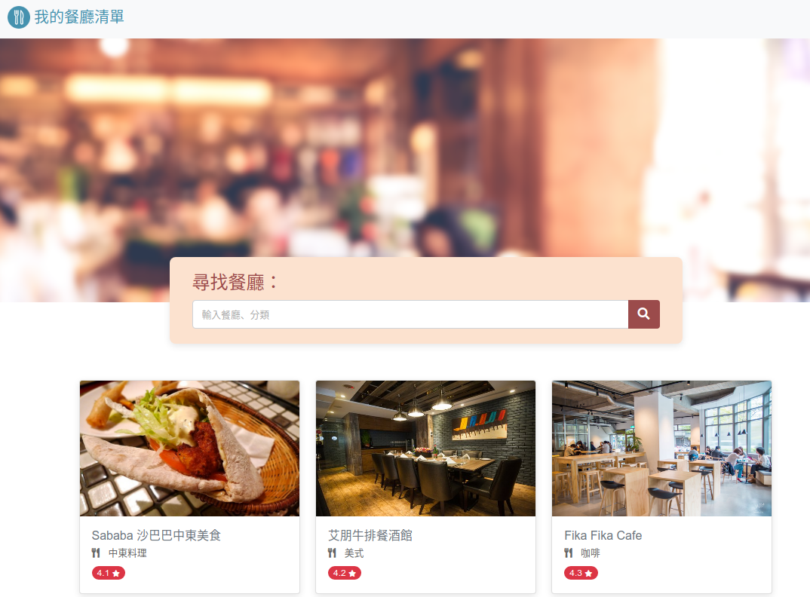

# restaurant-introduce
用來展示餐廳口袋清單的網站Demo

## 功能
- 顯示所有口袋清單
- 可以透過搜尋列搜尋餐廳名稱或種類
- 點選餐廳可觀看更詳細的餐廳介紹
## 使用
1. 複製專案
```
git clone https://github.com/kany102030/restaurant-introduce.git
```
2. 安裝 node.js 與 npm
- https://nodejs.org/
- https://www.npmjs.com/
3. 於專案資料夾開啟終端機輸入以下指令安裝相依套件
```
npm install
```
4. 執行專案
```
npm run start
```
5. 成功會顯示以下
```
> 2_3_a1@1.0.0 start
> node app.js

listening on http://localhost:3000
```
6. 打開瀏覽器輸入以下網址，即可看到DEMO畫面
http://localhost:3000/

## 開發套件版本
- Node.js: 16.16.0
- Express: 4.18.1
- Express-handlebars: 6.0.6
- Bootstrap: 4.3.1
- Font Awesome: 5.8.1
